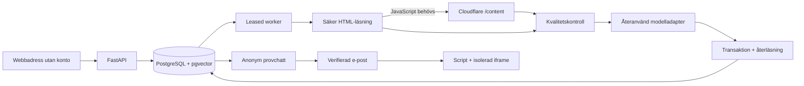

# Arkitektur

## Produktens väg

1. Startsidan har en enda primär uppgift: ange webbadress.
2. `POST /api/previews` kontrollerar URL, offentlig DNS och kostnadstak. Bot och jobb skapas i samma transaktion. En slumpmässig HttpOnly-cookie ger provåtkomst. Ingen e-post krävs.
3. En separat worker hämtar jobbet från PostgreSQL med `FOR UPDATE SKIP LOCKED`, får ett tidsbegränsat lease-token och förnyar det. Processkrasch kan återhämtas upp till tre försök.
4. Crawlern läser robots.txt, HTML och en begränsad mängd sitemap/länkar. JavaScript-skal eller mycket tunt scriptinnehåll får hanterad rendering.
5. Kvalitetskontroll, textdelning och embeddings skapar en kandidat. Kandidatens vektorer läses tillbaka med faktisk pgvector-sökning. Index, aktiv pekare, botstatus och avslutat jobb publiceras tillsammans i en transaktion med lease-kontroll.
6. Besökaren provchattar. Varje sökning binds till både bot-ID och aktiv version. Samtal binds dessutom till en serverhärledd session.
7. ”Lägg till på min hemsida” öppnar e-poststeget. En tidsbegränsad engångslänk verifierar e-post och skapar ägarsession.
8. En script-rad installeras. Kunden trycker ”Jag har lagt in koden”. Servern läser den publika sidan och kontrollerar scriptets exakta bot-ID och installationsnonce. Först då publiceras widgeten.

## Varför dessa teknikval?

**FastAPI och Coastworks-kärnan behålls.** Det är den naturliga återanvändningsgränsen. Modellfabriker, textdelning, DNS-skydd, renderingklassificering och renderingshjälpare följer med. Gamla adminrutter, breda konfigurationsmodeller, användarminne och dashboard gör det inte.

**En PostgreSQL ersätter Mongo + serialiserade FAISS-filer + separat kö.** För tusentals små assistenter med högst 300 textbitar per version är exakt pgvector-sökning inom botens index rimlig. En transaktion kan omfatta jobb, kandidat, aktiv pekare och status. Det eliminerar flera tidigare publiceringsgränser och behov av osäker pickle-inläsning. Företagsisolering ligger i obligatoriska botfilter, versioner och sessioner; det är inte ett påstående om implementerad PostgreSQL RLS. Före större datamängder: mät söktider och välj partitionering/HNSW efter faktisk last.

**Ingen extra Redis eller köleverantör.** PostgreSQL äger både jobb och status. Lease-token hindrar en gammal worker från att publicera efter återtagning. Schemalagd refresh får inte ersätta ett fungerande index med ett misslyckat resultat.

**Static first, hanterad webbläsare vid behov.** Max 8 sidförsök, 4 renderade sidor, 110 sekunders crawl och 170 sekunders total jobbtid. Textstorlek, antal källor och embeddings begränsas. Publika HTTP-adresser revalideras vid varje lokal anslutning. Redirects följs manuellt; http→https och www-kanonisering tillåts bara under samma värdnamn. Offsite-redirects vid sidläsning nekas.

Cloudflare återanvänder befintlig fungerande anslutning och en stateless `/content`-gräns. Den tidigare asynkrona `/crawl`-livscykeln följer inte med. [Officiellt API](https://developers.cloudflare.com/api/resources/browser_rendering/subresources/content/methods/create/).

Apifys Website Content Crawler har ett relevant adaptivt HTTP/webbläsarläge. Det är en kandidat för större, manuellt beställda Managed-inläsningar, men ett ytterligare obligatoriskt system skulle här lägga på kostnad och en ny jobblivscykel utan uppmätt nytta. Ingen Apify-fallback körs eller debiteras i denna implementation. [Officiell Actor-dokumentation](https://apify.com/apify/website-content-crawler).

## Vad betyder ”redo”?

Minst 300 ord totalt, minst 60 ord per behållen sida, tillräckligt många sidor relativt upptäckten (upp till tre), inga misslyckade sidförsök, minst 60 procent användbara tillåtna försök, deduplicerat innehåll, giltiga ändliga icke-nollvektorer och lyckad återläsning av kandidatindex. En verklig sida med omfattande text kan passera. En hemsida som bara lämnar navigation, botkontroll, inloggning eller ett tomt React-skal kan inte passera.

Det här är konservativa innehållsgrindar, **inte ett bevis på att samtliga sidor eller fakta på kundens webbplats har lästs**. Högst åtta sidor läses. Sök- och dokumentkvalitet behöver mätas på riktiga kunder; slutlig trygghet ges av provchatten och Managed-kvalitetssäkringen. Kvalitetsgrinden får hellre neka en besvärlig sida än lova en fungerande assistent utan underlag.

## Kostnad och säkerhet

- Anonym skapning: 5/IP/timme, 10/domän/dygn, globalt 100/dygn som standard.
- Provchatt: 30/bot/dygn. Widget: 60/IP/timme och 200/bot/dygn. Globalt 2 000 meddelanden/dygn. Databasräknare gör gränserna gemensamma för API-instanser.
- Browser Origin är installationspolicy, inte autentisering. Widgettoken är signerad, gäller 15 minuter och binds till bot och besökarsession. Att någon kan förfalska Origin med en serverklient hanteras med kostnadstak och perimeterbegränsning.
- Kundens sida får en iframe, så dess CSS och vår chatts DOM inte påverkar varandra. Text renderas som text, aldrig okontrollerad HTML. postMessage använder exakt mål-origin och föräldrafönsterkontroll.
- Webbtext är opålitligt material. Modellen har inga verktyg, läser ingen annan tenants data och får bara godkända källor. Instruktioner minskar promptinjektion men garanterar inte att modellen alltid följer dem.
- Cloudflare utför rendering i sin egen hanterade miljö. Vårt lokala DNS-skydd omfattar inte dess interna subresource-anslutningar; driftsätt workers med nätverksspärrar mot privata adresser och håll renderingsproviderns säkerhetskontrakt under uppföljning.
- Källrepots databas eller kunder importeras aldrig. `.env` är ignorerad och kommer inte in i containerbuild.

## Dyraste oprövade antagandet

Att ett begränsat och billigt urval ur en publik hemsida räcker för företagets vanligaste kundfrågor. Varken fler renderade sidor eller en bättre språkmodell kan skapa fakta som hemsidan saknar. Mät fråga/svar-kvalitet och faktiska kostnader på en representativ uppsättning företag innan löftet om en minut används i betald marknadsföring.
